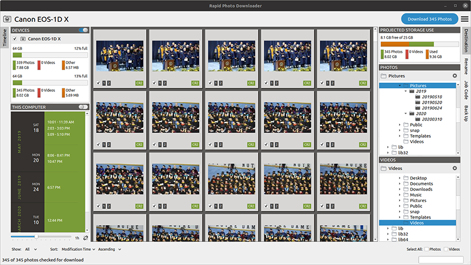

# Rapid Photo Downloader

[![GitButler](https://img.shields.io/badge/GitButler-%23B9F4F2?logo=data%3Aimage%2Fsvg%2Bxml%3Bbase64%2CPHN2ZyB3aWR0aD0iMzkiIGhlaWdodD0iMjgiIHZpZXdCb3g9IjAgMCAzOSAyOCIgZmlsbD0ibm9uZSIgeG1sbnM9Imh0dHA6Ly93d3cudzMub3JnLzIwMDAvc3ZnIj4KPHBhdGggZD0iTTI1LjIxNDUgMTIuMTk5N0wyLjg3MTA3IDEuMzg5MTJDMS41NDI5NSAwLjc0NjUzMiAwIDEuNzE0MDYgMCAzLjE4OTQ3VjI0LjgxMDVDMCAyNi4yODU5IDEuNTQyOTUgMjcuMjUzNSAyLjg3MTA3IDI2LjYxMDlMMjUuMjE0NSAxNS44MDAzQzI2LjcxOTcgMTUuMDcyMSAyNi43MTk3IDEyLjkyNzkgMjUuMjE0NSAxMi4xOTk3WiIgZmlsbD0iYmxhY2siLz4KPHBhdGggZD0iTTEzLjc4NTUgMTIuMTk5N0wzNi4xMjg5IDEuMzg5MTJDMzcuNDU3MSAwLjc0NjUzMiAzOSAxLjcxNDA2IDM5IDMuMTg5NDdWMjQuODEwNUMzOSAyNi4yODU5IDM3LjQ1NzEgMjcuMjUzNSAzNi4xMjg5IDI2LjYxMDlMMTMuNzg1NSAxNS44MDAzQzEyLjI4MDMgMTUuMDcyMSAxMi4yODAzIDEyLjkyNzkgMTMuNzg1NSAxMi4xOTk3WiIgZmlsbD0idXJsKCNwYWludDBfcmFkaWFsXzMxMF8xMjkpIi8%2BCjxkZWZzPgo8cmFkaWFsR3JhZGllbnQgaWQ9InBhaW50MF9yYWRpYWxfMzEwXzEyOSIgY3g9IjAiIGN5PSIwIiByPSIxIiBncmFkaWVudFVuaXRzPSJ1c2VyU3BhY2VPblVzZSIgZ3JhZGllbnRUcmFuc2Zvcm09InRyYW5zbGF0ZSgxNi41NzAxIDE0KSBzY2FsZSgxOS44NjQxIDE5LjgzODMpIj4KPHN0b3Agb2Zmc2V0PSIwLjMwMTA1NiIgc3RvcC1vcGFjaXR5PSIwIi8%2BCjxzdG9wIG9mZnNldD0iMSIvPgo8L3JhZGlhbEdyYWRpZW50Pgo8L2RlZnM%2BCjwvc3ZnPgo%3D)](https://gitbutler.com/)

Rapid Photo Downloader is a Linux desktop application that imports photos 
and videos from cameras, phones, memory cards, and other devices at high 
speed. It is written by a [photographer](https://damonlynch.net) for 
professional and amateur photographers. 

## Personal Note From the Developer

This project has only ever had one software developer. I developed a hand 
injury from typing while working on the code in early 2022. Code development 
has slowed considerably as I seek to recover from this serious injury. To 
work around the injury, fortunately I am able to use the JetBrains editor 
PyCharm in conjunction with the voice recognition tools Talon and Dragon 
NaturallySpeaking on Windows / WSL2. While my ability to test the code 
remains limited, at least I can write it.

I want to thank JetBrains for allowing me to use PyCharm Professional for 
free under their [open source developer program](https://www.jetbrains.com/community/opensource/#support).

In 2023, my existing case of Long Covid worsened considerably to the point 
that I could no longer work, to the extent I lost the ability to be 
employable. In 2024, I am slowly recovering. Currently, I am able to work 
part-time on the code (but remain unable to be employed). 

## Removal of the Install Script

Due to my hand injury (see above), I cannot maintain a custom `install.py` 
script that I used to provide &mdash; testing the script in the variety of 
Linux distributions it supports requires a lot of typing. The script is 
therefore removed.

## User Survey 

If you have any experience with Rapid Photo Downloader at all, including if 
you no longer use it, please join hundreds of others by taking this survey: 

[Survey of past, current, and potential users](https://survey.rapidphotodownloader.com/)

The responses are already making a real difference to the program’s future 
development. The program collects no analytics whatsoever, so a survey like 
this is truly helpful. Thank you in advance.

## Program Features

 - Rename photos and videos with meaningful filenames you specify.
 - Download vast numbers of photos and videos with minimum fuss.
 - Back up photos and videos as they are downloaded.
 - Downloads from and backs up to multiple devices simultaneously.
 - Easy to configure and use.
 - Configure program preferences without the need for complicated codes.
 - Automate common tasks, such as unmounting a memory card when the download 
   is complete. 

[Read more about its features at the program website](https://damonlynch.net/rapid/features.html).

  
## Documentation

[Full documentation is available at the program website](https://damonlynch.net/rapid/documentation/).

## Program Design

Rapid Photo Downloader is coded in Python. To get the best performance using 
Python on modern multi-core computers, the program uses multiple OS-level 
processes that communicate with each other using the messaging library 
[0MQ](https://zeromq.org/).

[Learn more about the program's architecture](https://damonlynch.net/rapid/design.html).
  

## Issue Reporting

Report new issues on the
[developer's GitHub repository](https://github.com/damonlynch/rapid-photo-downloader/issues).

Historic issues are at the previous code repository,
[Launchpad](https://bugs.launchpad.net/rapid). 

## Releases

Project releases have been historically hosted on the 
[project's Launchpad repository](https://launchpad.net/rapid/+download).

Future releases are to be hosted on the project's 
[GitHub repository](https://github.com/damonlynch/rapid-photo-downloader/releases). 

## Support

Get support at the [Pixls.us discussion forum](https://discuss.pixls.us/).

## Installation

Install the program using your Linux distribution's standard tools,
e.g., apt, dnf, or zypper.

Ubuntu users can install 
[the latest version using the project PPA](https://damonlynch.net/rapid/download.html). 

The program is currently not available as a Snap or flatpak because to
interact with cameras it requires being able to break out of the 
confinement Snap and flatpak enforce. This may change in future if 
there are workarounds for this confinement.

To install from source, consult [INSTALL.md](INSTALL.md).

## License

[GPL3 or later](https://choosealicense.com/licenses/gpl-3.0/).
